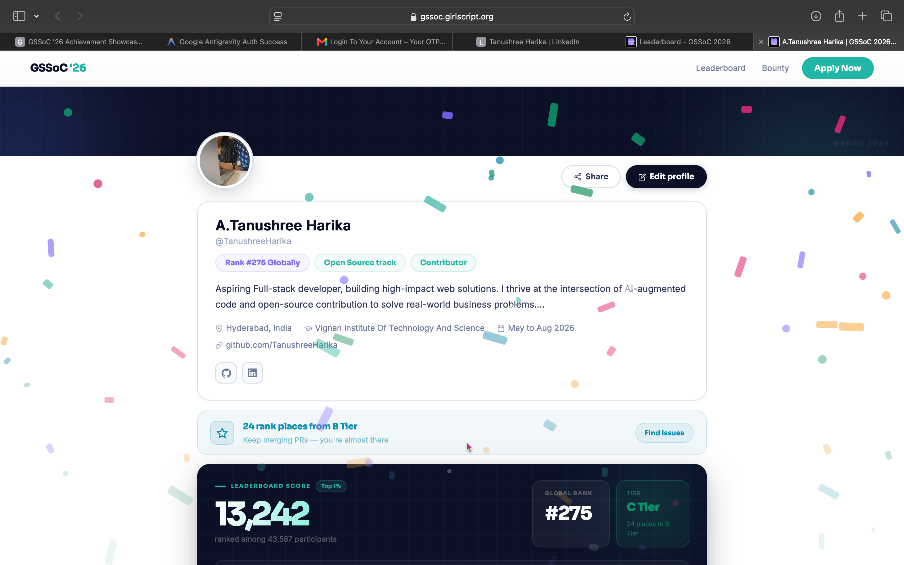

  <!-- Premium Styled Banner -->
  

   
   

  <!-- Header Section -->
  <h1 style="font-size: 2.5em; font-weight: 800; background: linear-gradient(45deg, #ff79c6, #bd93f9); -webkit-background-clip: text; -webkit-text-fill-color: transparent;">
     Tanushree Harika 
  </h1>
  
  

    <b>B.Tech Student</b> &nbsp;&middot;&nbsp; <b>Building AI-Powered Products</b> &nbsp;&middot;&nbsp; <b>Turning Ideas into Reality with Code</b>
  

   

  <!-- Interactive Identity/Quick-Navigation Array -->
  <table border="0" style="border-collapse: collapse; background: #1e1e2e; border-radius: 20px; padding: 12px 24px; box-shadow: inset 0 0 12px rgba(255, 121, 198, 0.1);">
    <tr>
      <td style="padding: 10px 15px;" align="center">
        
      </td>
      <td style="padding: 10px 15px;" align="center">
        
      </td>
      <td style="padding: 10px 15px;" align="center">
        
      </td>
      <td style="padding: 10px 15px;" align="center">
        
      </td>
    </tr>
  </table>

 
 

---

## ⚡ About Me

* 🚀 **Building in Public:** Engineering scalable full-stack applications & AI-powered product engines.
* 🤖 **AI-Augmented Developer:** Leveraging LLMs and intelligent workflows to rapidly scaffold, test, and ship production code.
* 🎯 **Goal:** Seeking **Software Engineering & Full-Stack Internships (2026)** to build high-impact systems.

---

## 🌟 Highlighted Deployments & Projects

<table border="0" width="100%">
  <!-- Project 1: Hamster -->
  <tr>
    <td width="100%" style="background: #1e1e2e; border-radius: 12px; padding: 18px; border: 1px solid #44475a;">
      <table border="0" width="100%">
        <tr>
          <td>
            <h3 style="color: #ff79c6; margin: 0;">🐹 Hamster: Sandboxed CLI Coding Agent (Beta)</h3>
            
<i>Python 3.11+ • Docker • OpenRouter API • Ripgrep • Tiktoken • PyPI</i>

          </td>
          <td align="right" valign="top">
            
          </td>
        </tr>
      </table>
      <ul style="color: #f8f8f2; font-size: 13.5px; margin: 10px 0 0 0; padding-left: 18px;">
        <li>Autonomous CLI agent powered by OpenRouter LLMs with a two-stage <b>plan-then-execute engine</b>.</li>
        <li>Features ripgrep file search, fuzzy diff patching, token compaction, and sandboxed Docker execution.</li>
        <li>Published and installable via PyPI as <code>hamster-agent</code>.</li>
      </ul>
    </td>
  </tr>

  <tr><td height="12"></td></tr>

  <!-- Project 2: NexMatch AI -->
  <tr>
    <td width="100%" style="background: #1e1e2e; border-radius: 12px; padding: 18px; border: 1px solid #44475a;">
      <table border="0" width="100%">
        <tr>
          <td>
            <h3 style="color: #ff79c6; margin: 0;">🔍 NexMatch AI — Job Matching Platform</h3>
            
<i>FastAPI • Vanilla JS • SQLite • OpenAI API • Vercel</i>

          </td>
          <td align="right" valign="top">
            
            &nbsp;
            
          </td>
        </tr>
      </table>
      <ul style="color: #f8f8f2; font-size: 13.5px; margin: 10px 0 0 0; padding-left: 18px;">
        <li>AI matching engine pairing candidates to jobs automatically via multi-variable scoring.</li>
        <li>Includes PDF resume parsing, automated skill gap analysis, interactive roadmaps, and dynamic score calculation.</li>
      </ul>
      
<code style="color: #bd93f9; font-size: 11px;">Match Engine = Skills (40%) + Experience (25%) + Location (20%) + Salary Fit (15%)</code>

    </td>
  </tr>

  <tr><td height="12"></td></tr>

  <!-- Project 3: Stealth Headless CMS -->
  <tr>
    <td width="100%" style="background: #1e1e2e; border-radius: 12px; padding: 18px; border: 1px solid #44475a;">
      <table border="0" width="100%">
        <tr>
          <td>
            <h3 style="color: #ff79c6; margin: 0;">🔐 Stealth Headless CMS for Portfolio</h3>
            
<i>Next.js • React • JWT Authentication • Upstash Redis • Vercel</i>

          </td>
          <td align="right" valign="top">
            
            &nbsp;
            
          </td>
        </tr>
      </table>
      <ul style="color: #f8f8f2; font-size: 13.5px; margin: 10px 0 0 0; padding-left: 18px;">
        <li>Embedded headless CMS with hidden admin UI unlocked via JWT middleware authentication.</li>
        <li>Enables real-time dynamic CRUD operations backed by Upstash Redis without requiring re-deploys.</li>
      </ul>
    </td>
  </tr>
</table>

---

<!-- 🏆 System Achievements & Hall of Fame -->

  <table border="0" width="100%">
    <tr>
      <td align="center" valign="top" style="padding: 10px 0;">
        <h4 style="color: #ff79c6; font-size: 1.2em; margin-bottom: 8px;">🏅 GirlScript Summer of Code (GSSoC 2026)</h4>
        

          Ranked <b>#275 globally out of 43,587+ developers</b> • <b>13,242 points</b> earned • Merged <b>26+ PRs</b> across multi-stack repositories.
        

        

          
          
          
          
        

         
        <h4 style="color: #bd93f9; font-size: 1.05em; margin-bottom: 10px;">📊 Official Contributor Dashboard</h4>
        
      </td>
    </tr>
  </table>

---

## 📊 Telemetry & Analytics

  
  

 

  
  

---

## 🛠️ Syntactic Core (Tech Stack)

  <table border="0" width="100%">
    <tr>
      <!-- Column 1: Frontend Architecture -->
      <td width="33.3%" align="center" valign="top" style="border-right: 1px solid #44475a; padding: 10px;">
        <h4 style="color: #ff79c6; margin-bottom: 5px;">🌐 Frontend</h4>
        
<i>Interactive User Interfaces</i>

        
      </td>
      <!-- Column 2: Backend & Database Mesh -->
      <td width="33.3%" align="center" valign="top" style="border-right: 1px solid #44475a; padding: 10px;">
        <h4 style="color: #bd93f9; margin-bottom: 5px;">⚙️ Backend & DB</h4>
        
<i>APIs & Database Engines</i>

        
      </td>
      <!-- Column 3: Cloud & Tooling -->
      <td width="33.3%" align="center" valign="top" style="padding: 10px;">
        <h4 style="color: #8be9fd; margin-bottom: 5px;">☁️ Tools & Cloud</h4>
        
<i>Pipelines & Environment</i>

        
      </td>
    </tr>
  </table>

---

## 🐍 Contribution Space Game

  <picture>
    <source media="(prefers-color-scheme: dark)" srcset="https://raw.githubusercontent.com/TanushreeHarika/TanushreeHarika/output/github-contribution-grid-snake-dark.svg">
    <source media="(prefers-color-scheme: light)" srcset="https://raw.githubusercontent.com/TanushreeHarika/TanushreeHarika/output/github-contribution-grid-snake.svg">
    
  </picture>

---

## 🌐 Connect & Collaborate

  Let's build something impactful. Reach out for collaborations or internship opportunities!

  <table border="0" style="border-collapse: collapse;">
    <tr>
      <td align="center" style="padding: 0 20px;">
        
         
        /TanushreeHarika
      </td>
      <td align="center" style="padding: 0 20px;">
        
         
        in/tanushreeharika
      </td>
      <td align="center" style="padding: 0 20px;">
        
         
        harileet100@gmail.com
      </td>
    </tr>
  </table>

 

---

  <h3>✨ Thanks for Dropping By ✨</h3>
  
🚀 Let's push some code that matters. If you find my projects interesting, consider leaving a star! ⭐

   
  

