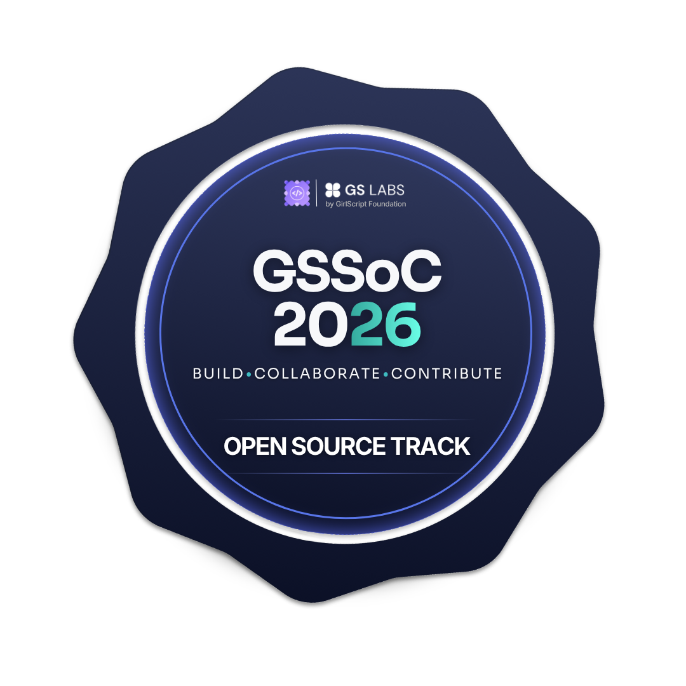

  <!-- Premium Styled Banner with rounded aesthetic edges -->
  

   
   

  <!-- Header Section with customized stylized sizing -->
  <h1 style="font-size: 2.5em; font-weight: 800; background: linear-gradient(45deg, #ff79c6, #bd93f9); -webkit-background-clip: text; -webkit-text-fill-color: transparent;">
    ✨ Tanushree Harika ✨
  </h1>
  
  

    <b>B.Tech Student</b> &nbsp;&middot;&nbsp; <b>Building AI-Powered Products</b> &nbsp;&middot;&nbsp; <b>Turning Ideas into Reality with Code</b>
  

   

  <!-- Interactive Identity/Quick-Navigation Array -->
  <table border="0" style="border-collapse: collapse; background: #1e1e2e; border-radius: 20px; padding: 12px 24px; box-shadow: inset 0 0 12px rgba(255, 121, 198, 0.1);">
    <tr>
      <td style="padding: 10px 20px;" align="center">
        <!-- Profile View Counter integrated cleanly -->
        
      </td>
      <td style="padding: 10px 20px;" align="center">
        
      </td>
      <td style="padding: 10px 20px;" align="center">
        
      </td>
      <td style="padding: 10px 20px;" align="center">
        
      </td>
    </tr>
  </table>

 
 
---

## 📊 Telemetry & Insights (The Numbers)

<table border="0" width="100%">
  <!-- Row 1: General Profile Analytics -->
  <tr>
    <td width="55%" align="left" valign="middle">
      <h3>📈 System Architecture Metrics </h3>
      
A high-level view of execution metrics. Tracking commit velocities, repository distributions, and total platform impact in real-time.

      
<i><code>Status: Optimizing background routines for cleaner git graphs.</code></i>

    </td>
    <td width="45%" align="center" valign="middle">
      
    </td>
  </tr>

  <!-- Row 2: Language Distribution -->
  <tr>
    <td width="45%" align="center" valign="middle">
      
    </td>
    <td width="55%" align="left" valign="middle">
      <h3>🔮 Language Ecosystem Breakdown</h3>
      
My codebase composition. Dominated by fast full-stack platforms and strongly structured system environments.

      
📄 <b>Note:</b> This reflects cross-stack execution limits, moving fluidly between typed backend pipelines and responsive frontend states.

    </td>
  </tr>

  <!-- Row 3: Streak Telemetry -->
  <tr>
    <td width="55%" align="left" valign="middle">
      <h3>🔥 Codebase Persistence  (Streak)</h3>
      
An objective record of momentum. Iterative, daily pushes to ensure code quality stays high and ideas get turned into production files fast.

      
<i><code>Loop state: While true -> write code, deploy, repeat.</code></i>

    </td>
    <td width="45%" align="center" valign="middle">
      
    </td>
  </tr>

  <!-- Row 4: Activity Volume Graphic -->
  <tr>
    <td width="45%" align="center" valign="middle">
      
    </td>
    <td width="55%" align="left" valign="middle">
      <h3>📈 Production Load Vector</h3>
      
A wave analysis mapping developer output volume over the current timeline quarters. Spikes track intense multi-day sprint completions and product scaffolding cycles.

    </td>
  </tr>
</table>

---

## 🔮 Terminal Profile: /about-me

I am an execution-focused engineer specializing in modern full-stack systems and automated product delivery. I thrive on translating conceptual logic into clean codebases and designing high-fidelity, scalable applications.

* **🎯 Intent:** Actively pursuing Software Engineering & Full-Stack Summer Internship Opportunities (2026).
* **⚡ Deep Diving:** Advanced Next.js architectures, high-performance API design, and telemetry.
* **🪐 Aesthetic:** Merging premium Silicon Valley interfaces with precise modular layouts.
---

## 🤖 AI-Augmented Workflow

> *"The future belongs to developers who treat AI as an production accelerator, not a crutch."*

I intentionally design my development pipelines around a state-of-the-art **AI-augmented workflow** to collapse the time from idea to working prototype:

* **Rapid Prototyping:** Leveraging Large Language Models (LLMs) to stress-test software architecture paradigms and scaffold database schemas.
* **Prompt Engineering:** Structuring deterministic context constraints to generate predictable, clean, and typed code components.
* **AI-Assisted Operations:** Utilizing intelligent terminal instrumentation to dramatically speed up code profiling, debugging cycles, and multi-service testing.
* **Iterative Building:** Combining precise system design intuition with machine execution speeds to ship MVPs in a fraction of standard schedules.

---

## 🛠️ Syntactic Core (Tech Stack)

  <table border="0" width="100%">
    <tr>
      <!-- Column 1: Frontend Architecture -->
      <td width="33.3%" align="center" valign="top" style="border-right: 1px solid #44475a; padding: 10px;">
        <h4 style="color: #ff79c6;">🌐 Frontend Systems</h4>
        
<i>High-fidelity interfaces & components</i>

         
        
      </td>
      <!-- Column 2: Backend & Database Mesh -->
      <td width="33.3%" align="center" valign="top" style="border-right: 1px solid #44475a; padding: 10px;">
        <h4 style="color: #bd93f9;">⚙️ Backend & Storage</h4>
        
<i>High-throughput APIs & relational engines</i>

         
        
      </td>
      <!-- Column 3: Cloud & Engineering Design -->
      <td width="33.3%" align="center" valign="top" style="padding: 10px;">
        <h4 style="color: #8be9fd;">☁️ Infrastructure & Design</h4>
        
<i>Deployment pipelines & modern wireframes</i>

         
        
      </td>
    </tr>
  </table>

---

## 🏆 System Achievements & Hall of Fame

  <table border="0" width="100%">
    <tr>
      <td align="center" valign="top" style="padding: 20px 0;">
        <h4>🏅 GirlScript Summer of Code (GSSoC 2026)</h4>
        

          Constantly maintaining a <b>Top 400 Rank out of 45,000+ developers</b> by actively shipping production features, optimizing workflows, and refactoring codebase logic across open-source ecosystems.
        

         
        
        
        
      </td>
    </tr>
  </table>

---

## 🌟 Highlighted Deployments

<!-- Real projects automatically updated from your dashboard -->
<table border="0" width="100%">
  <tr>
    <td width="50%" align="center">
      
    </td>
    <td width="50%" align="center">
      
    </td>
  </tr>
</table>

---

## 🐍 Contribution Space Game

  Watch the automated compiler navigate my git tracking timeline in real-time.

  <picture>
    <source media="(prefers-color-scheme: dark)" srcset="https://raw.githubusercontent.com/TanushreeHarika/TanushreeHarika/output/github-contribution-grid-snake-dark.svg">
    <source media="(prefers-color-scheme: light)" srcset="https://raw.githubusercontent.com/TanushreeHarika/TanushreeHarika/output/github-contribution-grid-snake.svg">
    
  </picture>

---

## 🌐 Connect & Collaborate

  Let's build something impactful. Whether you want to talk about modern full-stack architecture, AI workflows, or upcoming summer internship opportunities—feel free to reach out!

 

  <table border="0" style="border-collapse: collapse;">
    <tr>
      <!-- GitHub Card -->
      <td align="center" style="padding: 0 25px;">
        
         
        /TanushreeHarika
      </td>
      <!-- LinkedIn Card -->
      <td align="center" style="padding: 0 25px;">
        
         
        in/tanushreeharika
      </td>
      <!-- Gmail Card -->
      <td align="center" style="padding: 0 25px;">
        
         
        harileet100@gmail.com
      </td>
    </tr>
  </table>

 
 

---

  <h3>✨ Thanks for Dropping By ✨</h3>
  
🚀 Let's push some code that matters. If you find my projects interesting, consider leaving a star! ⭐

   
  

